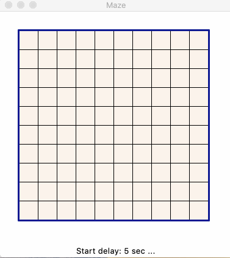
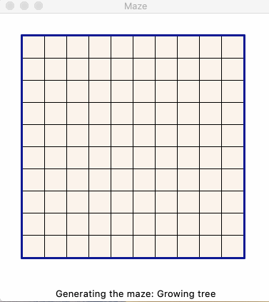

<!-- omit in toc -->
# Mazes

Python implementations for maze generation, visualization, and solving.

## Intro

I've stumbled upon an article about an archeological examination of a game for Atari called [Entombed](https://en.wikipedia.org/wiki/Entombed_(Atari_2600)). The interesting part was about an endless maze generation with laughably small memory available (literally few dozen bites). This made me realize I have never looked into maze generation, so I went to wikipedia's [Maze Generation Algorithm](https://en.wikipedia.org/wiki/Maze_generation_algorithm) page and instantly wanted to implement recursive split algorithm. It was also a good opportunity to figure out Python's standard `tkinter` GUI library.

Doing some research I found an abosultely amazing [Jamis Buck's blog](http://weblog.jamisbuck.org/under-the-hood/) with 12 (!!!) algorithms for maze generation and this got me hooked. I had to implement a generic mini framework for maze generation, solving, and visualization, where you can simply add a class with a generator or a solver, and get a nice visualization.

- [Intro](#intro)
- [Syntax](#syntax)
- [Examples](#examples)
  - [Recursive split](#recursive-split)
  - [Recursive backtracking](#recursive-backtracking)
  - [Hunt-and-kill](#hunt-and-kill)
  - [Kruskal's algorithm](#kruskals-algorithm)
  - [Binary tree algorithm](#binary-tree-algorithm)
  - [Growing tree algorithm](#growing-tree-algorithm)
    - [Always pick a random cell - Prim's:](#always-pick-a-random-cell---prims)
    - [Oldest vs Oldest/Newest 1:1](#oldest-vs-oldestnewest-11)
    - [Newest vs Newest/Random 1:1](#newest-vs-newestrandom-11)
    - [Newest/Random/Oldest 1:1:2](#newestrandomoldest-112)
- [Links](#links)
- [TODO](#todo)

## Syntax

```
usage: maze_client.py [-h] [-n N] [-a A] [--algs] [-m M] [-s S] [-d D]
                      [--start_delay START_DELAY] [-w W] [--start row col]
                      [--finish row col] [--solver {dfs,bfs}]

Creates an NxN maze using the specified algorithm.

optional arguments:
  -h, --help            show this help message and exit

maze generation:
  -n N                  maze size
  -a A                  maze generation algorithm
  --algs                list supported maze generation algorithms
  -m M                  algorithm parameters, see alg list for details
  -s S                  random seed, use to generate repeatable mazes

maze visualization:
  -d D                  simulation delay in seconds, can be a fraction
  --start_delay START_DELAY
                        start delay in seconds, can be a fraction
  -w W                  tile width in px

maze solving:
  --start row col       maze entrance coordinates
  --finish row col      maze exit coordinates
  --solver {dfs,bfs}    maze solver algorithm

Rows and columns indices start with 0 in the top-right corner.

$ python3 maze_client.py --algs
List of supported maze generation algorithms:

        0       Recursive split 50/50
        1       Recursive split at random
        2       Recursive backtracking
        3       Hunt-and-kill
        4       Binary tree (SE biased)
        5       Growing tree (Prim's)
```

## Examples

### Recursive split

Recursive splitting 50/50 and opening a randomly positioned door:

`$ python3 maze_client.py -n 10 -w 30 -d 0.2`


Recursive splitting at a random point and opening a randomly positioned door:

`$ python3 maze_client.py -n 10 -w 30 -d 0.2 -a 2`


### Recursive backtracking

`$ python3 maze_client.py -n 10 -w 30 -d 0.2 -a 2`


### Hunt-and-kill

Does not require backtracking, thus generates less windy passages

`$ python3 maze_client.py -n 10 -w 30 -a 3 -d 0.15 --start 4 4 --finish 9 4`


### Kruskal's algorithm

An easy to implement algorithm if you have UnionFind data structure. If you don't, UF is easy to implement too ;-)

`python3 maze_client.py -n 10 -w 30 -d 0.07 -a 4 --solver bfs  --finish 9 4`


### Binary tree algorithm

Does not require state, extremely simple to implement. The downside is an express bias; below example has a south-east bias.

`$ python3 maze_client.py -n 10 -w 30 -a 5 -d 0.07 --finish 9 4`


### Growing tree algorithm

An interesting algorithm which is simple to implement with the behaviour adjustable by how it selects the next cell to process:

- Create an empty bag to hold cells. Put one random cell in it
- Pick a cell from the bag and remove a wall between it and any neighbouting unvisited cell. Add this new cell to the bag. If there are no unvisited neighbors, remove the cell from the bag
- Repeat until no cells left in the bag

Possible strategies for picking a cell from the bag:

- always pick the most recently added item, which effectively recreates recursive backtracking algorithm
- always pick a random item, in which case it becomes the Prim's MST algorithm where edges are selected randomly rather than by weight
- always pick the oldest item in the bag; this generated a degenerated maze.

The implementation allows to specify weighted strategies like so:

   `-p <policy:weight>[,<policy:weight>,...]`

This allows simulation of combined strategies, for example picking the newest item and a random item with 2:1 ration: `-p n:2,r:1`.

#### Always pick a random cell - Prim's:

`$ python3 maze_client.py -n 10 -w 30 -d 0.07 -a 5 -p 5:1  --finish 9 4`


#### Oldest vs Oldest/Newest 1:1

Picking always oldest creates a soft of degenerated maze, but once selection alternates between oldest and newest cell a nice looking maze is generated with longer streight sections but verall shorter passages (i.e. combination of recursive backtracking and degenerated always-oldest variant):

| Oldest |  Oldest/Newest 1:1 |
| --- | --- |
|  |  |

Generated with:

`$ python3 maze_client.py -n 10 -w 30 --solver bfs -s 2 -a 5 -p o --finish 9 4`
`$ python3 maze_client.py -n 10 -w 30 --solver bfs -s 2 -a 5 -p o:1,n:1 --finish 9 4`

#### Newest vs Newest/Random 1:1

| Newest |  Newest/Random 1:1 |
| --- | --- |
|  |  |

#### Newest/Random/Oldest 1:1:2

Generated with:

`$ python3 maze_client.py -n 10 -w 30 --solver bfs -s 2 -a 5 -p n:1 --finish 9 4`
`$ python3 maze_client.py -n 10 -w 30 --solver bfs -s 2 -a 5 -p n:1,r:1 --finish 9 4`

## Links

* [Entombed](https://en.wikipedia.org/wiki/Entombed_(Atari_2600))
* [Maze Generation Algorithm](https://en.wikipedia.org/wiki/Maze_generation_algorithm)
* [Jamis Buck's blog](http://weblog.jamisbuck.org/under-the-hood/)
* [Maze Classification](http://www.astrolog.org/labyrnth/algrithm.htm)

## TODO

- [x] Fix wall chipping
- [x] Add starting and finishing locations for the maze solver
- [x] Hunt and kill alg
- [x] Growing tree alg
- [x] Binary tree alg
- [x] Kruskal's alg
- [x] Add BFS solver
- [ ] ASCII representation for mazes
- [x] Options to skip maze generation and solving animations
- [ ] Refactor Maze class to store walls as a bitmap
- [x] Refactor direction names
- [x] Parameters support for splitting alg
- [x] Parameters support for GT alg
- [x] Move tile state to visualizer
- [ ] Update animations in README