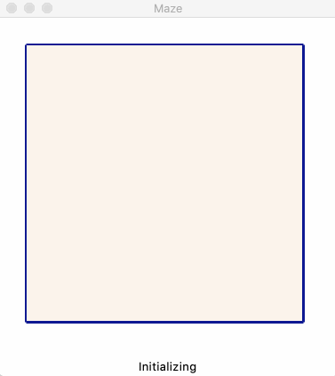
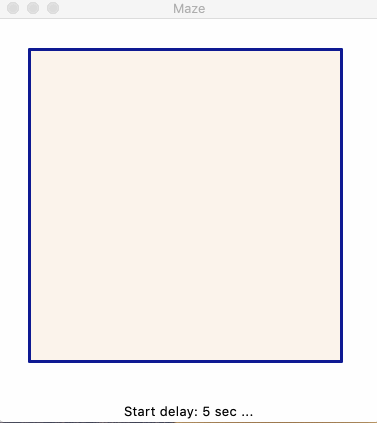
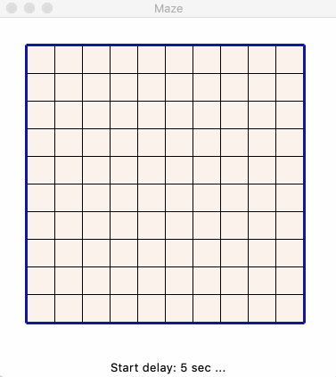
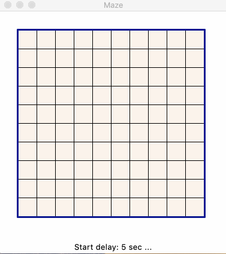
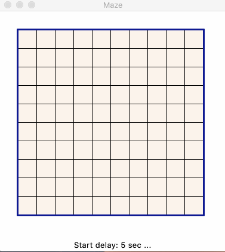

<!-- omit in toc -->
# Mazes

Python implementations for maze generation, visualization, and solving.

## Intro

I've stumbled upon an article about an archeological examination of a game for Atari called [Entombed](https://en.wikipedia.org/wiki/Entombed_(Atari_2600)). The interesting part was about an endless maze generation with laughably small memory available (literally few dozen bites). This made me realize I have never looked into maze generation, so I went to wikipedia's [Maze Generation Algorithm](https://en.wikipedia.org/wiki/Maze_generation_algorithm) page and instantly wanted to implement recursive split algorithm. It was also a good opportunity to figure out Python's standard `tkinter` GUI library.

Doing some research I found an abosultely amazing [Jamis Buck's blog](http://weblog.jamisbuck.org/under-the-hood/) with 12 (!!!) algorithms for maze generation and this got me hooked. I had to implement a generic mini framework for maze generation, solving, and visualization, where you can simply add a class with a generator or a solver, and get a nice visualization.

- [Intro](#intro)
- [Syntax](#syntax)
- [Examples](#examples)
  - [Recursive split](#recursive-split)
  - [Recursive backtracking](#recursive-backtracking)
  - [Hunt-and-kill](#hunt-and-kill)
  - [Binary tree algorithm](#binary-tree-algorithm)
  - [Growing tree algorithm](#growing-tree-algorithm)
    - [Prim's](#prims)
- [Links](#links)
- [TODO](#todo)

## Syntax

```
usage: maze_client.py [-h] [-n N] [-a A] [--algs] [-m M] [-s S] [-d D]
                      [--start_delay START_DELAY] [-w W] [--start row col]
                      [--finish row col] [--solver {dfs,bfs}]

Creates an NxN maze using the specified algorithm.

optional arguments:
  -h, --help            show this help message and exit

maze generation:
  -n N                  maze size
  -a A                  maze generation algorithm
  --algs                list supported maze generation algorithms
  -m M                  algorithm parameters, see alg list for details
  -s S                  random seed, use to generate repeatable mazes

maze visualization:
  -d D                  simulation delay in seconds, can be a fraction
  --start_delay START_DELAY
                        start delay in seconds, can be a fraction
  -w W                  tile width in px

maze solving:
  --start row col       maze entrance coordinates
  --finish row col      maze exit coordinates
  --solver {dfs,bfs}    maze solver algorithm

Rows and columns indices start with 0 in the top-right corner.

$ python3 maze_client.py --algs
List of supported maze generation algorithms:

        0       Recursive split 50/50
        1       Recursive split at random
        2       Recursive backtracking
        3       Hunt-and-kill
        4       Binary tree (SE biased)
        5       Growing tree (Prim's)
```

## Examples

### Recursive split

Recursive splitting 50/50 and opening a randomly positioned door:

`$ python3 maze_client.py -n 10 -w 30 -d 0.2`



Recursive splitting at a random point and opening a randomly positioned door:

`$ python3 maze_client.py -n 10 -w 30 -d 0.2 -a 2`



### Recursive backtracking

`$ python3 maze_client.py -n 10 -w 30 -d 0.2 -a 2`


### Hunt-and-kill

Does not require backtracking, thus generates less windy passages

`$ python3 maze_client.py -n 10 -w 30 -a 3 -d 0.15 --start 4 4 --finish 9 4`



### Binary tree algorithm

Does not require state, extremely simple to implement. The downside is an express bias; below example has a south-east bias.

`$ python3 maze_client.py -n 10 -w 30 -a 4 -d 0.07 --finish 9 4`



### Growing tree algorithm

An interesting algorithm which is simple to implement, while the behaviour can be changed with how you select next cell to process.

#### Prim's 

The algorithm becomes Prim's algorithm if the next cell is picked randomly from the stack:

`$ python3 maze_client.py -n 10 -w 30 -d 0.07 -a 5  --finish 9 4`



## Links

* [Entombed](https://en.wikipedia.org/wiki/Entombed_(Atari_2600))
* [Maze Generation Algorithm](https://en.wikipedia.org/wiki/Maze_generation_algorithm)
* [Jamis Buck's blog](http://weblog.jamisbuck.org/under-the-hood/)
* [Maze Classification](http://www.astrolog.org/labyrnth/algrithm.htm)

## TODO

- [x] Fix wall chipping
- [x] Add starting and finishing locations for the maze solver
- [x] Hunt and kill alg
- [ ] Growing tree alg
- [x] Binary tree alg
- [x] Add BFS solver
- [ ] ASCII representation for mazes
- [ ] Options to skip maze generation and solving animations